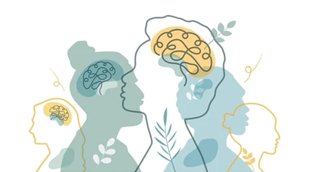
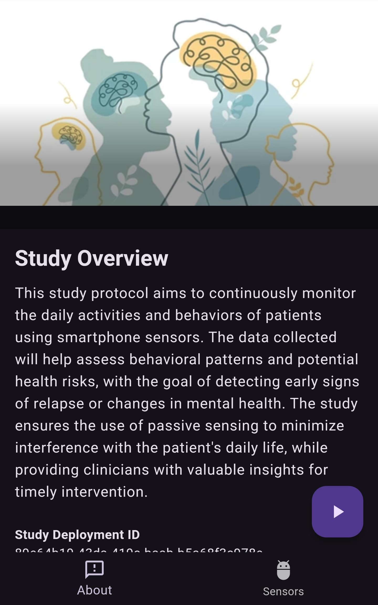
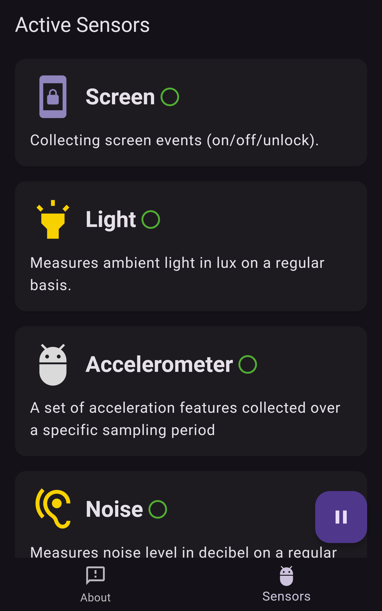
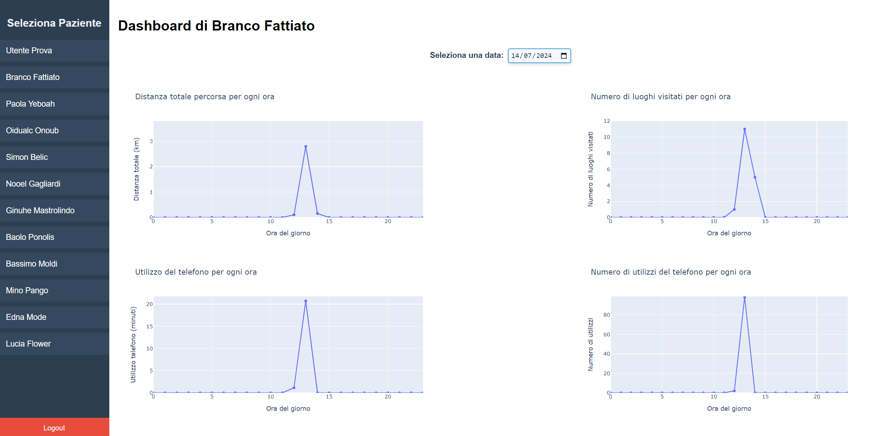
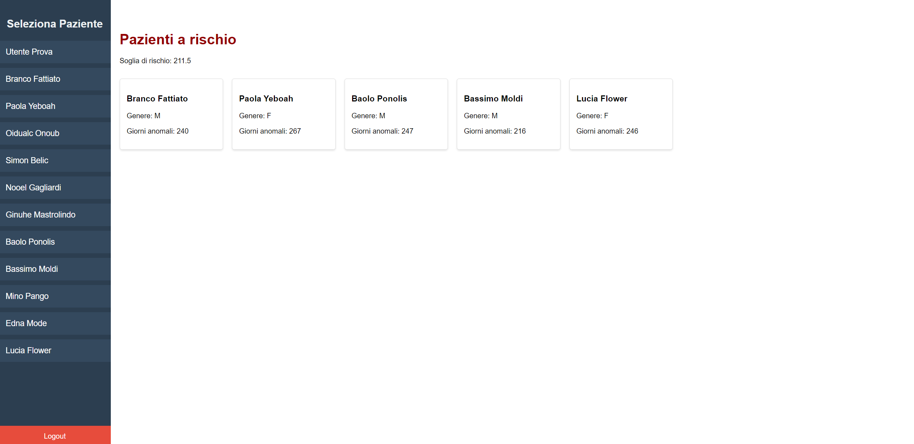

<!-- Improved compatibility of back to top link: See: https://github.com/othneildrew/Best-README-Template/pull/73 -->

<!--
*** Thanks for checking out the Best-README-Template. If you have a suggestion
*** that would make this better, please fork the repo and create a pull request
*** or simply open an issue with the tag "enhancement".
*** Don't forget to give the project a star!
*** Thanks again! Now go create something AMAZING! :D
-->

<!-- PROJECT SHIELDS -->
<!--
*** I'm using markdown "reference style" links for readability.
*** Reference links are enclosed in brackets [ ] instead of parentheses ( ).
*** See the bottom of this document for the declaration of the reference variables
*** for contributors-url, forks-url, etc. This is an optional, concise syntax you may use.
*** https://www.markdownguide.org/basic-syntax/#reference-style-links
-->

[//]: # ([![Contributors][contributors-shield]][contributors-url])

[//]: # ([![Forks][forks-shield]][forks-url])

[//]: # ([![Stargazers][stars-shield]][stars-url])

[//]: # ([![Issues][issues-shield]][issues-url])

[//]: # ([![MIT License][license-shield]][license-url])

[//]: # ([![LinkedIn][linkedin-shield]][linkedin-url])

<!-- PROJECT LOGO -->
 

  

<h3 align="center">SchizoMonitor</h3>
  

    A system for monitoring and assisting patients with schizophrenia
     
    <a href="https://github.com/Gianpyy/schizomonitor/tree/main/docs"><strong>Explore the docs »</strong></a>
     
  

<!-- ABOUT THE PROJECT -->
## 📖 About The Project
**SchizoMonitor** is a system developed as part of my bachelor’s degree final exam,
focused on using smartphones to collect behavioral data from patients with schizophrenia.
By collecting data from sensors such as GPS, screen events, light, acceleration, noise,
and audio, SchizoMonitor helps predict potential relapses by analyzing patterns in the
patients’ daily behavior. The system also includes a medical dashboard where healthcare
professionals can monitor patients in real-time, identify those at risk of relapse,
and intervene manually to prevent the relapse before it occurs.

### 🛠️ Developed With

* [![Flutter][Flutter]][Flutter-url]
* [![CARP Mobile Sensing][CARP Mobile Sensing]][CARP-url]
* [![Python][Python]][Python-url]
* [![Flask][Flask]][Flask-url]
* [![TensorFlow][TensorFlow]][TensorFlow-url]
* [![Scikit-learn][Scikit-learn]][Scikit-learn-url]
* [![MongoDB][MongoDB]][MongoDB-url]
* [![IntelliJIDEA][IntelliJIDEA]][IntelliJIDEA-url]

(<a href="#readme-top">back to top</a>)

<!-- FEATURES -->
## 🚀 Features

* **Mobile Sensor Data Collection**: The system collects data from various phone sensors, including:
  * **GPS**: Tracks geographic location and movement.
  * **Screen Events**: Logs when the device screen is on or off.
  * **Ambient Light**: Measures surrounding light conditions.
  * **Accelerometer**: Captures device movements to analyze physical activity.
  * **Noise Levels**: Monitors environmental noise and conversation levels.
  * **Conversations**: Tracks social interactions through conversation data.
* **Data Processing**: The collected sensor data is processed to calculate key hourly metrics such as:
  * **Distance Traveled**
  * **Number of Places Visited**
  * **Total Screen Time**
* **Predictive Model Integration**: The system feeds data into a predictive model that estimates the likelihood of patient relapse.
* **Monitoring Dashboard**: The dashboard visualizes real-time metrics and prediction data, enabling healthcare professionals to monitor patient status and intervene when necessary.
* **Secure Data Storage**: All collected sensor data is securely stored in the database with precise timestamps.

(<a href="#readme-top">back to top</a>)

<!-- DOCUMENTATION -->
## 📄 Documentation
You can access the full thesis <a href="docs/Thesis.pdf">here</a>, which provides an in-depth view of the following topics:

* **Schizophrenia** and its traditional medical care approaches
* **Relapse prediction** for schizophrenia patients
* A comprehensive description of **SchizoMonitor** and its development process

Please note that the thesis is written in **Italian**. You may use your preferred translation tool if needed.

(<a href="#readme-top">back to top</a>)

<!-- INSTALLATION -->
## 🖥️ Installation

For detailed setup instructions, refer to the <a href="docs/Installation_manual.pdf">installation manual</a>, which contains a step-by-step guide to run the project on your machine.

(<a href="#readme-top">back to top</a>)

<!-- SCREENSHOTS -->
## 📸 Screenshots

  

    
    
  

  
  
  

(<a href="#readme-top">back to top</a>)

<!-- AUTHOR -->
## 👤 Author

The project was developed by [Gianpio Silvestri](https://github.com/Gianpyy) in 2024.

(<a href="#readme-top">back to top</a>)

<!-- MARKDOWN LINKS & IMAGES -->
<!-- https://www.markdownguide.org/basic-syntax/#reference-style-links -->
[contributors-shield]: https://img.shields.io/github/contributors/github_username/repo_name.svg?style=for-the-badge
[contributors-url]: https://github.com/github_username/repo_name/graphs/contributors
[forks-shield]: https://img.shields.io/github/forks/github_username/repo_name.svg?style=for-the-badge
[forks-url]: https://github.com/github_username/repo_name/network/members
[stars-shield]: https://img.shields.io/github/stars/github_username/repo_name.svg?style=for-the-badge
[stars-url]: https://github.com/github_username/repo_name/stargazers
[issues-shield]: https://img.shields.io/github/issues/github_username/repo_name.svg?style=for-the-badge
[issues-url]: https://github.com/github_username/repo_name/issues
[license-shield]: https://img.shields.io/github/license/github_username/repo_name.svg?style=for-the-badge
[license-url]: https://github.com/github_username/repo_name/blob/master/LICENSE.txt
[linkedin-shield]: https://img.shields.io/badge/-LinkedIn-black.svg?style=for-the-badge&logo=linkedin&colorB=555
[linkedin-url]: https://linkedin.com/in/linkedin_username
[product-screenshot]: images/screenshot.png
[Flutter]: https://img.shields.io/badge/Flutter-02569B?style=for-the-badge&logo=flutter&logoColor=white
[Flutter-url]: https://flutter.dev
[CARP Mobile Sensing]: https://img.shields.io/badge/CARP_Mobile_Sensing-E53935?style=for-the-badge&logo=android&logoColor=white
[CARP-url]: https://carp.cachet.dk/cams/
[Python]: https://img.shields.io/badge/Python-3776AB?style=for-the-badge&logo=python&logoColor=white
[Python-url]: https://www.python.org
[Flask]: https://img.shields.io/badge/Flask-000000?style=for-the-badge&logo=flask&logoColor=white
[Flask-url]: https://flask.palletsprojects.com/
[TensorFlow]: https://img.shields.io/badge/TensorFlow-FF6F00?style=for-the-badge&logo=tensorflow&logoColor=white
[TensorFlow-url]: https://www.tensorflow.org/
[Scikit-learn]: https://img.shields.io/badge/Scikit--learn-F7931E?style=for-the-badge&logo=scikit-learn&logoColor=white
[Scikit-learn-url]: https://scikit-learn.org/
[MongoDB]: https://img.shields.io/badge/MongoDB-47A248?style=for-the-badge&logo=mongodb&logoColor=white
[MongoDB-url]: https://www.mongodb.com/
[IntelliJIdea]: https://img.shields.io/badge/IntelliJ_IDEA-000000?style=for-the-badge&logo=intellij-idea&logoColor=white
[IntelliJIdea-url]: https://www.jetbrains.com/idea/
